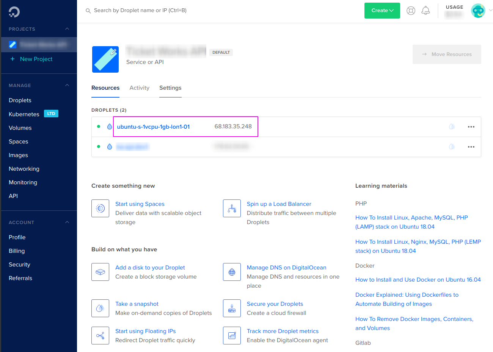

# Steps for add new server in DO:

## 1. Login to [digitalocean.com](https://digitalocean.com)
## 2. Select menu "Droplets"


## 3. Create droplet


## 4. Select OS Ubuntu 18.04 and instance type 


## 5. Scroll down this page and select datacentr

## 6. Enable monitoring


## 7. Add you own ssh public key


### 7.1 Get ssh public key

```shell
cat ~/.ssh/id_rsa.pub
```

### Example

```key
ssh-rsa AAAAB3NzaC1yc2EAAAADAQABAAAAgQC82fwDlRpja21kWJzZ47Y1URzetjk5hN58vwmlFr/7NsFDqIr6Ry9L85zyTfWnr+8rPbJ7/FOYjYV43fUQtWUUZtBmaYSaZOx9tbSF0RTFxPHrrh0c/N+msVOmrKlgHtj9XJJwnKVCQ/q2g+07dqDyp3gkC2ohE4yMLp+7i8FSFQ== user@hostname
```

### 7.2 Add new ssh public key


### 7.3 Enable all needed ssh keys

They will be added to the droplet.


## 8. Set hostname and create instance


## 9. In a few minutes a new droplet will be created.



# Result

You have new droplet on Digital Ocean

|   |   |
| -------- | ---------------- |
| SSH USER | `root`           |
| SSH HOST | ip from `step 9` |
| SSH PORT | `22`             |

## Connect via SSH

```shell
ssh root@1.1.1.1
```